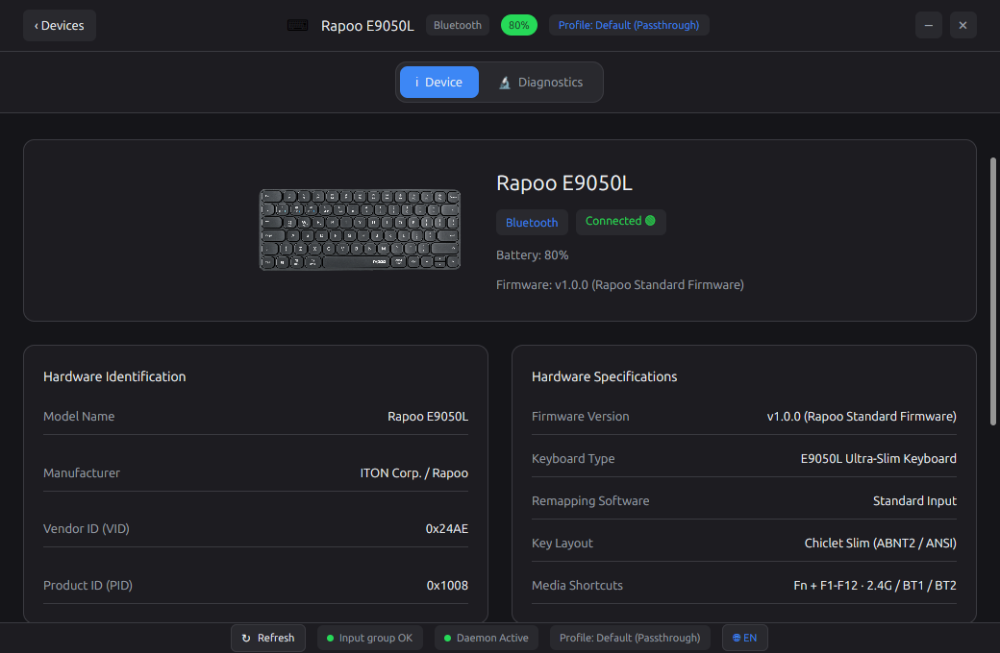

# OpenRapoo

<p align="center">
  <strong>Configurador Nativo e Daemon para Linux para o Mouse Rapoo MT760 Pro e Dispositivos Rapoo</strong>
</p>

<p align="center">
  <a href="README.md"><strong>English</strong></a> |
  <a href="README.pt-BR.md"><strong>Português do Brasil</strong></a>
</p>

<p align="center">
  
</p>

---

O OpenRapoo é uma suíte open source para Linux desenvolvida em **Rust** com **GPUI** para oferecer suporte a recursos, personalização de DPI, taxa de amostragem (polling rate), remapeamento de botões e telemetria de bateria para mouses e teclados Rapoo—especialmente o **Rapoo MT760 Pro**.

Este projeto foi desenvolvido utilizando o **Google Antigravity** para solucionar a ausência total de software oficial de configuração da fabricante para o sistema operacional Linux.

Inspirado pelo [OpenLogi](https://github.com/AprilNEA/OpenLogi).

---

> [!WARNING]
> **Aviso de Desenvolvimento Ativo e Possíveis Bugs**:
> O OpenRapoo encontra-se na **Versão 0.1.0** e está em constante evolução. Como foi desenvolvido para suprir a falta de suporte da fabricante no Linux, **o software pode conter bugs** ou comportamentos inesperados dependendo da sua distribuição Linux, ambiente gráfico (Wayland/X11) ou versão do Kernel. Se você encontrar algum problema ou bug, por favor [abra uma Issue no GitHub](https://github.com/waltenne/openrapoo/issues)!

---

## 🎯 Por que o OpenRapoo foi criado

A Rapoo **não disponibiliza software oficial de configuração para sistemas operacionais Linux**. Usuários que conectam mouses Rapoo (como o MT760 Pro) no Linux enfrentam diversos problemas:
1. Impossibilidade de remapear botões laterais extras ou o scroll lateral do polegar.
2. Impossibilidade de ajustar níveis de sensibilidade DPI e taxa de amostragem USB.
3. Ausência de monitoramento confiável de bateria entre conexões USB, Dongle 2.4 GHz e Bluetooth.
4. Dependência total de softwares proprietários exclusivos para Windows (`.exe`).

O OpenRapoo resolve esses problemas fornecendo uma interface gráfica nativa, leve e segura (sem necessidade de root) e um daemon de usuário que se integra com as APIs `evdev`, `uinput`, `hidraw`, `UPower` e `BlueZ` D-Bus.

---

## 💻 Matriz de Compatibilidade

### Hardware Suportado
- **Mouse Rapoo MT760 Pro**: Vendor ID `0x24AE`, Product ID `0x186A` (USB/Dongle 2.4GHz) & `0x4510` (Bluetooth).
- **Teclado Rapoo E9050L**: Vendor ID `0x24AE`, Product ID `0x1008`.
- **Outros Dispositivos Rapoo Wireless/HID**: Identificação e isolamento multi-dispositivo.

### Distribuições e Sistemas Linux Suportados
- **Debian / Ubuntu** (Ubuntu 22.04 LTS, 24.04 LTS, Linux Mint, Pop!_OS)
- **Arch Linux / Manjaro** (Kernel 5.x / 6.x)
- **Fedora / RHEL** (com módulos de kernel `evdev` e `uinput`)
- **openSUSE & Distribuições Linux em Geral** com suporte a `udev`, `evdev`, `uinput`, `UPower` e `BlueZ`.
- **Arquiteturas**: `x86_64` (`amd64`).

---

## 🚦 Matriz de Funcionalidades

| Funcionalidade | Disponível | Experimental | Planejada |
| :--- | :---: | :---: | :---: |
| **Detecção de Dispositivos (USB / Dongle / BT)** | ✅ | | |
| **Interface Gráfica GPUI** | ✅ | | |
| **Remapeamento de Botões via Daemon uinput** | ✅ | | |
| **Persistência de Perfis e Configurações** | ✅ | | |
| **Internacionalização Bilíngue (Inglês e Português)** | ✅ | | |
| **Monitoramento de Bateria (UPower / BlueZ / HID)** | ✅ | | |
| **Empacotamento .deb e AppImage** | ✅ | | |
| **Leitura Direta de Relatório HID 0x07** | | 🧪 | |
| **Varredura Bluetooth GATT 0x180F** | | 🧪 | |
| **Filtro de Sub-interfaces Inativas do Receptor** | | 🧪 | |
| **Gravação de Perfis na EEPROM do Hardware** | | | 📋 |
| **Engenharia Reversa de Protocolo HID Proprietário** | | | 📋 |
| **Ferramenta de Atualização de Firmware** | | | 📋 |

---

## 📊 Matriz de Dispositivos e Conexões

| Transporte | Detecção de Conexão | Remapeamento de Botões | Telemetria de Bateria | DPI / Polling Rate Real |
| :--- | :---: | :---: | :---: | :---: |
| **Cabo USB** | ✅ Confirmado | ✅ Confirmado | ⚠️ N/A (Alimentado pela USB) | 🧪 Experimental (Relatório HID) |
| **Dongle USB 2.4 GHz** | ✅ Confirmado | ✅ Confirmado | ✅ Confirmado (HID/UPower) | 🧪 Experimental (Relatório HID) |
| **Bluetooth** | ✅ Confirmado | ✅ Confirmado | ✅ Confirmado (BlueZ D-Bus) | ⚠️ Gerenciado pelo Kernel (~90-133 Hz) |

---

## 📦 Instalação

### Debian / Ubuntu (.deb)

Baixe o pacote `.deb` nas [Releases do GitHub](https://github.com/waltenne/openrapoo/releases):

```bash
sudo dpkg -i openrapoo_0.1.0_amd64.deb
sudo apt install -f
```

### AppImage Standalone

Baixe o AppImage nas [Releases do GitHub](https://github.com/waltenne/openrapoo/releases):

```bash
chmod +x OpenRapoo-0.1.0-x86_64.AppImage
./OpenRapoo-0.1.0-x86_64.AppImage
```

### Compilação a partir do Código Fonte

```bash
# Instalar dependências (Ubuntu/Debian)
sudo apt install build-essential pkg-config libhidapi-dev libudev-dev libevdev-dev libdbus-1-dev desktop-file-utils libx11-dev libx11-xcb-dev libxcb-xfixes0-dev libxcb-shape0-dev libxcb-render0-dev libxcb1-dev libfontconfig1-dev libxkbcommon-dev libxkbcommon-x11-dev libgl1-mesa-dev

# Compilar o workspace
cargo build --release --workspace

# Executar suíte de empacotamento
./packaging/build-all.sh
```

---

## 🔑 Permissões e Segurança

O OpenRapoo executa a GUI como usuário comum sem necessidade de `sudo`. O acesso ao hardware em `/dev/hidraw*` e `/dev/input/event*` é concedido de forma segura via regras UDev e inclusão no grupo `input`.

```bash
# Adicionar seu usuário ao grupo input
sudo usermod -aG input $USER

# Instalar regra UDev
sudo cp udev/99-openrapoo.rules /etc/udev/rules.d/
sudo udevadm control --reload-rules
sudo udevadm trigger
```

*Nota: Encerre a sessão e entre novamente para que as alterações de grupo surtam efeito.*

---

## 🤖 Transparência sobre o uso do Google Antigravity e IA

O OpenRapoo foi desenvolvido com o auxílio do **Google Antigravity** e ferramentas de pareamento com Inteligência Artificial. A IA foi utilizada para pesquisa, arquitetura, geração de código, automação de testes, internacionalização e documentação. As decisões técnicas, revisões de código, testes físicos no hardware e a validação final são de responsabilidade do mantenedor do projeto.

Para mais detalhes, leia o [Guia de Desenvolvimento com IA](docs/pt-BR/ai-assisted-development.md).

---

## 📚 Índice da Documentação

- [Guia de Arquitetura](docs/pt-BR/architecture.md)
- [Guia de Instalação](docs/pt-BR/installation.md)
- [Guia de Desenvolvimento](docs/pt-BR/development.md)
- [Solução de Problemas](docs/pt-BR/troubleshooting.md)
- [Matriz de Suporte a Hardware](docs/pt-BR/hardware-support.md)
- [Declaração de Desenvolvimento com IA](docs/pt-BR/ai-assisted-development.md)

---

## 📜 Licença

Distribuído sob a licença **GPL-3.0-or-later**.
