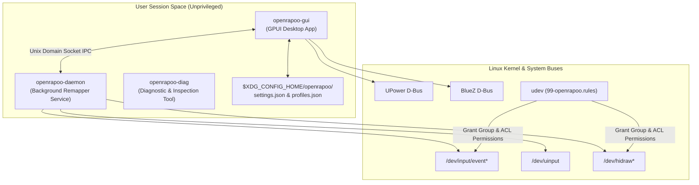

# OpenRapoo Architecture Guide

This document outlines the software architecture, component separation, communication flow, and security permissions model of OpenRapoo.

---

## 🏗️ System Overview

---

## 📦 Component Separation

### 1. `openrapoo-core`
The foundational library containing:
- Data types for profiles, button mappings, DPI levels, polling rates.
- Battery telemetry aggregation logic (`query_battery_multi_provider`).
- Device detection via `/proc/bus/input/devices`, `/sys/class/hidraw`, `/sys/class/power_supply`.
- IPC message serialization and socket path resolution (`$XDG_RUNTIME_DIR/openrapoo.sock`).

### 2. `openrapoo-daemon`
The background remapping daemon:
- Runs as a systemd user service (`openrapoo-daemon.service`).
- Listens on Unix domain socket for IPC commands from `openrapoo-gui`.
- Captures physical mouse events via `evdev` and emits remapped virtual keyboard/mouse events via `uinput`.
- Maintains snapshot states for instant profile restoration.

### 3. `openrapoo-gui`
The GPUI graphical user interface:
- High-performance, GPU-accelerated desktop application.
- Centered tabbed interface: Buttons, Pointer & Performance, Device Details, Battery Diagnostics.
- Persistent i18n localization engine (English `en-US` and Portuguese `pt-BR`).
- Settings persistence manager (`$XDG_CONFIG_HOME/openrapoo/settings.json`).

### 4. `openrapoo-diag`
Diagnostic & investigation CLI utility:
- Generates hardware diagnostic reports (`openrapoo-diag generate-report`).
- Interactive button identification and HID raw descriptor dumping.

---

## 📄 Configuration Storage

- **Settings**: `$XDG_CONFIG_HOME/openrapoo/settings.json`
- **Profiles**: `$XDG_CONFIG_HOME/openrapoo/profiles.json`
- **Logs**: `~/.local/share/openrapoo/`

