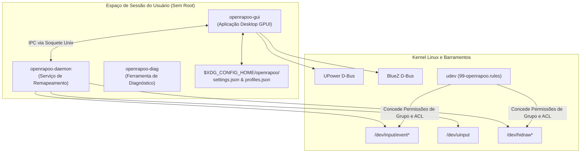

# Guia de Arquitetura do OpenRapoo

Este documento descreve a arquitetura de software, a separação de componentes, o fluxo de comunicação e o modelo de permissões do OpenRapoo.

---

## 🏗️ Visão Geral do Sistema

---

## 📦 Separação de Componentes

### 1. `openrapoo-core`
Biblioteca base contendo:
- Tipos de dados para perfis, mapeamentos de botões, níveis de DPI e taxas de amostragem.
- Lógica de agregação de telemetria de bateria (`query_battery_multi_provider`).
- Detecção de dispositivos via `/proc/bus/input/devices`, `/sys/class/hidraw`, `/sys/class/power_supply`.
- Serialização IPC e resolução do caminho do soquete Unix (`$XDG_RUNTIME_DIR/openrapoo.sock`).

### 2. `openrapoo-daemon`
Daemon de remapeamento em segundo plano:
- Executado como serviço systemd user (`openrapoo-daemon.service`).
- Ouve em soquete Unix comandos IPC vindos do `openrapoo-gui`.
- Captura eventos físicos do mouse via `evdev` e emite eventos virtuais via `uinput`.
- Mantém snapshots de estado para restauração instantânea de perfil.

### 3. `openrapoo-gui`
Interface gráfica em GPUI:
- Aplicação desktop de alto desempenho com aceleração por GPU.
- Navegação por abas centralizadas: Botões, Ponteiro & Desempenho, Detalhes do Dispositivo, Diagnóstico de Bateria.
- Sistema de internacionalização persistente (Inglês `en-US` e Português `pt-BR`).
- Gerenciador de configurações persistentes (`$XDG_CONFIG_HOME/openrapoo/settings.json`).

### 4. `openrapoo-diag`
Utilitário de linha de comando para diagnóstico e investigação:
- Gera relatórios de diagnóstico de hardware (`openrapoo-diag generate-report`).
- Identificação interativa de botões e leitura de descritores HID raw.

---

## 📄 Armazenamento de Configurações

- **Configurações Gerais**: `$XDG_CONFIG_HOME/openrapoo/settings.json`
- **Perfis de Botões**: `$XDG_CONFIG_HOME/openrapoo/profiles.json`
- **Logs e Relatórios**: `~/.local/share/openrapoo/`

